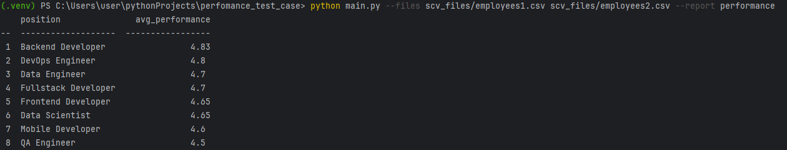
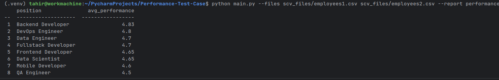
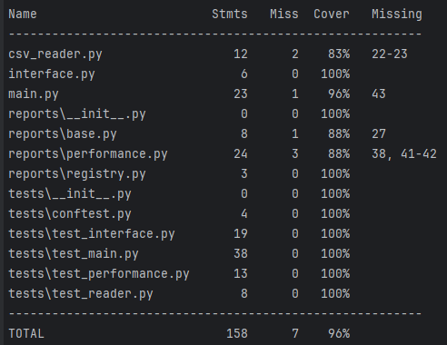

# Performance Test Case


## Оглавление:
- [О проекте](#о-проекте)
- [Основные возможности](#основные-возможности)
- [Технологический стек](#технологический-стек)
- [Структура проекта](#структура-проекта)
- [Установка и запуск](#установка-и-запуск):
    - [Клонирование проекта](#клонирование-проекта)
    - [Создание виртуального окружения](#создание-виртуального-окружения)
    - [Активация виртуального окружения](#активация-виртуального-окружения)
    - [Установка зависимостей](#установка-зависимостей)
- [Пример запуска](#пример-запуска)
- [Тесты](#тесты)

## О проекте

Скрипт для анализа эффективности работы разработчиков на основе scv-файлов с данными о выполненных задачах.

**Цель проекта:** автоматизировать формирование отчетов по эффективности сотрудников, упрощая контроль и анализ командной работы.

## Основные возможности

- Обработка одного или нескольких CSV-файлов с данными о сотрудниках.
- Формирование отчета performance с указанием позиции и средней эффективности.
- Сортировка отчета по убыванию средней эффективности.
- Вывод отчета в консоль в виде таблицы. 
- Возможность расширения для создания новых видов отчетов (например, по навыкам сотрудников).

## Технологический стек

**Язык:** Python 3.11+

**Библиотеки:**
- Стандартная библиотека: argparse, csv, statistics 
- Для отображения таблиц: tabulate 
- Для тестов: pytest, pytest-cov, coverage

## Структура проекта
```
perfomance_test_case/
│   csv_reader.py
│   interface.py
│   main.py
│   README.md
│   requirements.txt
│
├────reports
│       base.py
│       performance.py
│       registry.py
│       __init__.py
│
├────scv_files
│       employees1.csv
│       employees2.csv
│
├────static
│       screen_1.png
│       screen_2.png
│       screen_1_Ubuntu.png
│
└────tests
        conftest.py
        test_interface.py
        test_main.py
        test_performance.py
        test_reader.py
        __init__.py
```

## Установка и запуск
Рекомендуется создать виртуальное окружение и установить зависимости:

### Клонирование проекта

```bash
git clone https://[актуальный адрес проекта].git
cd perfomance_test_case
```


### Создание виртуального окружения

Для Windows:
```bash
python -m venv .venv
```

Для Linux:
```bash
python3 -m venv venv
```

### Активация виртуального окружения

Для Windows:
```bash
.venv\Scripts\activate 
```

Для Linux:
```bash
source venv/bin/activate
```

### Установка зависимостей

```bash
pip install -r requirements.txt
```


## Пример запуска
```bash
python main.py --files scv_files/employees1.csv scv_files/employees2.csv --report performance
```
Windows:

Linux:



## Тесты
Запуск тестов:
```bash
pytest -v
```
Запуск тестов с покрытием:
```bash
pytest --cov=. --cov-report=term-missing
```



